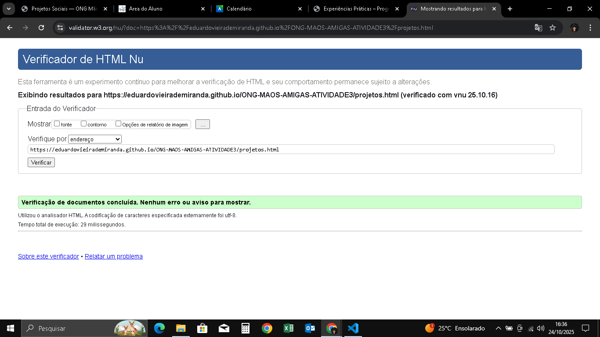

# 🌍 ONG MÃOS AMIGAS — Atividade 3

Projeto desenvolvido como parte da **Atividade Prática 3** do curso de **Análise e Desenvolvimento de Sistemas** (Cruzeiro do Sul Virtual).

Nesta etapa foram aplicados conceitos de **HTML5**, **JavaScript**, **SPA (Single Page Application)**, **jQuery** e **máscaras de formulário**.

---

## 🏠 Página Inicial (Home)

A *Home* é a porta de entrada do site e tem como objetivo apresentar a ONG e suas ações sociais.  
Ela contém as seções principais:

| Seção | Descrição |
|-------|------------|
| **Hero (Topo)** | Destaque com a frase *“Juntos Podemos Transformar o Mundo”*, atualizada via JavaScript. |
| **Quem Somos** | Explica a missão da ONG e mostra uma imagem representando o trabalho voluntário. |
| **Como Ajudar** | Exibe informações de doação via PIX, e-mail e QR Code interativo. |
| **Projetos em Destaque** | Mostra dois projetos principais com imagens e descrições. |

📱 O QR Code de doação permite que os visitantes façam uma contribuição rapidamente usando o celular.

---

## 🧾 Página de Cadastro

A página **cadastro.html** contém um formulário para novos voluntários.  
Campos incluídos:
- Nome completo  
- E-mail  
- Telefone  
- CPF  
- CEP e Cidade  
- Área de interesse  
- Mensagem opcional  

🔧 Recursos adicionais:
- Máscaras automáticas de CPF, Telefone e CEP (via **jQuery Mask**).  
- Mensagens de validação nativas do navegador.  
- Cards laterais com informações de **doação** e **motivos para ser voluntário**.

---

## 💡 Página de Projetos

A página **projetos.html** apresenta os principais projetos da ONG:

| Projeto | Descrição |
|----------|------------|
| **Projeto Esperança** | Voltado a crianças em vulnerabilidade social, com esportes e atividades educativas. |
|

Cada projeto é exibido em formato de **card responsivo**, mantendo a harmonia visual com o restante do site.

---

## 🧩 Scripts Implementados

```javascript
// Atualiza o título da Home dinamicamente
const titulo = document.getElementById("Juntos");
if (titulo) titulo.textContent = "Juntos Podemos Transformar Vidas";


// SPA simples (salva última página visitada)
localStorage.setItem("maosamigas.pagina", id);

📷 Prints de Validação (W3C)

As três páginas foram testadas no W3C Validator
 e estão 100% válidas.


Página	Resultado	Print



