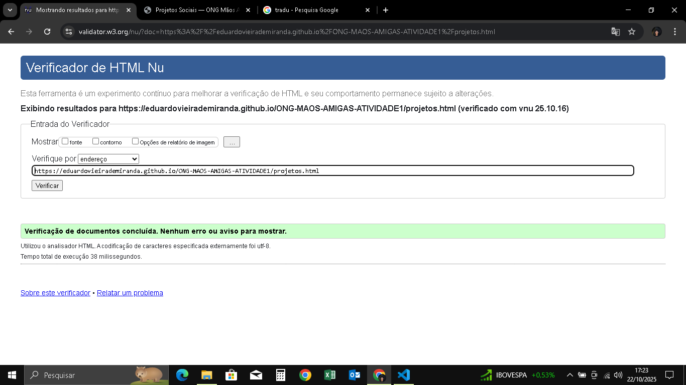
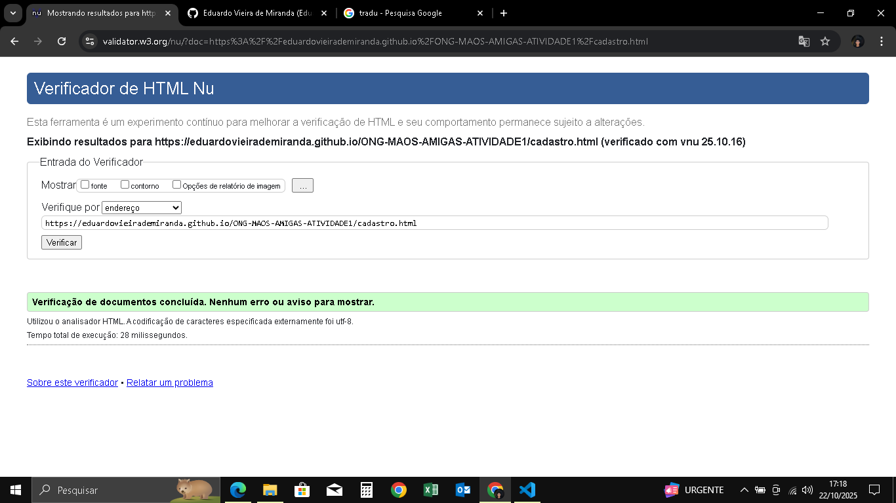

✅ Modelo de README.md — Atividade 1
# ONG Mãos Amigas — Atividade 1

Este repositório contém a **primeira etapa** do projeto da disciplina **Desenvolvimento Front-End para Web** da **Cruzeiro do Sul Virtual**.

## 📋 Descrição
A Atividade 1 tem como objetivo desenvolver a **estrutura HTML5** de um site fictício de uma ONG, com marcação semântica, acessibilidade básica e um formulário com máscaras funcionais.

## 🧱 Estrutura

index.html
projetos.html
cadastro.html
imagens/

## 💡 Tecnologias utilizadas
- **HTML5**  
- **JavaScript (jQuery Mask Plugin)** — usado apenas para aplicar máscaras em campos de CPF, Telefone e CEP

## ✅ Requisitos atendidos
- Uso de tags semânticas (`header`, `main`, `section`, `footer`)
- Estrutura organizada em múltiplas páginas
- Formulário funcional com máscaras
- Imagens otimizadas e com texto alternativo
- Código validado no **W3C Validator**
    

## 📬 Contato
Desenvolvido por *Eduardo Vieira de Miranda*  
[text](https://github.com/eduardovieirademiranda)